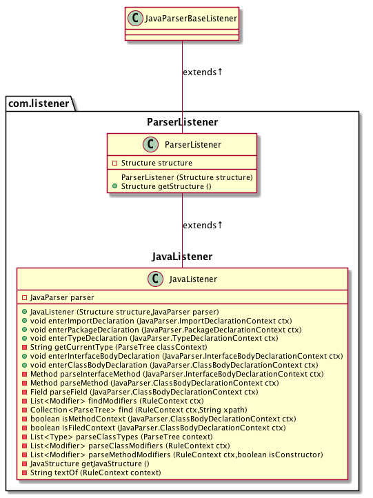

## CODE-2-UML
---

**code-2-uml** is a convenient parser to parse java code (a file or project) to plantuml language and export a class 
diagram. Combining the tools of [ANTLR v4](https://github.com/antlr/antlr4) and [plantuml](https://plantuml.com/)

## Usage

##### 1 download the **[code-2-uml](https://github.com/Aceysx/code-2-uml/blob/master/lib/)** jar 
##### 2 parse your java code to class diagram 
```java
java -jar code-2-uml.jar CODE_PATH
```
##### 3 ... you will plantuml code for class diagram and pic in current dir. like below

## Q&A

##### 1 if you want to generate huge diagram, you need to set env variable
```
java -DPLANTUML_LIMIT_SIZE=30960 -jar code-2-uml.jar CODE_PATH 
```
> from https://plantuml.com/zh/faq